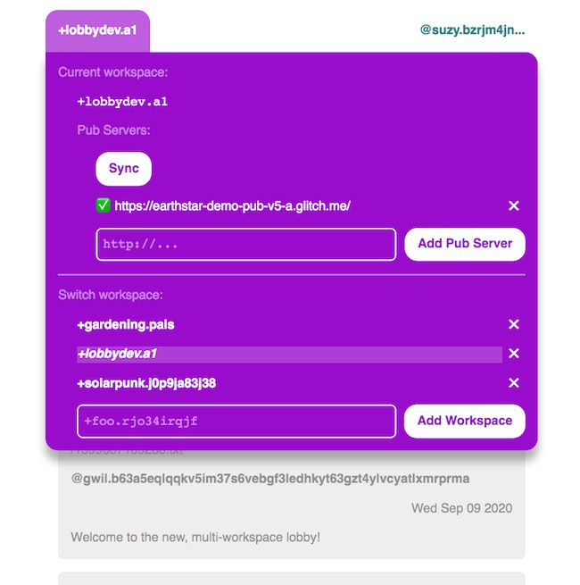

# Earthstar Foyer

Status: in progress

A guestbook-style web application built with [Earthstar](https://github.com/cinnamon-bun/earthstar).

Compatible with [earthstar-lobby](https://github.com/sgwilym/earthstar-lobby/).  It uses the same document paths and data format.  However it can only use some of the same pubs, not all:

| app                | plain pubs | GraphQL pubs |
| -------------------|------------|--------------|
| this app           | yes        | 🚫 not yet   |
| `earthstar-lobby`  | yes        | yes          |

## Live demo

https://earthstar-foyer.netlify.app/

To use it, open up the purple Workspaces tab and click Sync.

The blue User tab is not working yet.

## Progress

Done
* Switching / adding workspaces
* Editing pubs
* Syncing (with vanilla pubs, not GraphQL pubs)
* Viewing posts
* Persist settings to localStorage
* Persist workspace data to localStorage

Not done
* Auto-sync on load
* Writing posts
* Editing posts
* Changing / creating users

## Screenshot

